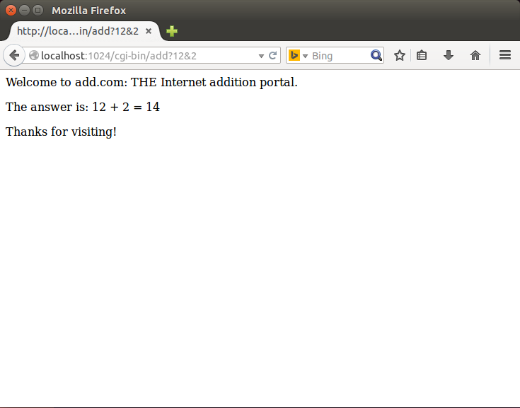

# Tiny-Web-Server
a learning test from csapp

###how to use

    make
    cd cgi-bin
    gcc -o add add.c
    cd ..
    ./tiny <port>

you may add csapp.h to /usr/include
    
###see:
####serve_static:

####serve_dynamic:

